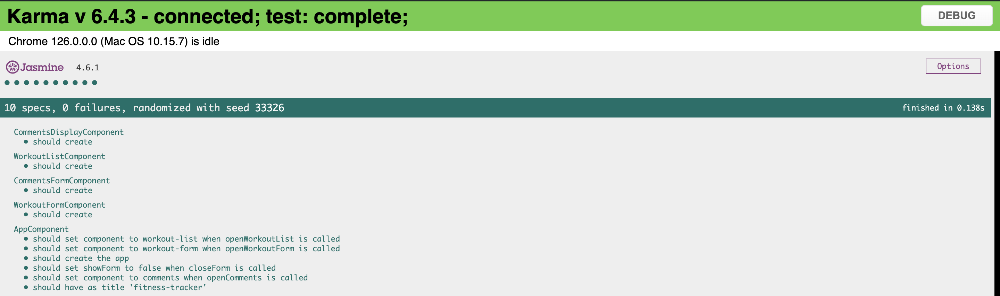

---

# Workout Tracker SPA

An Angular 18 single-page application (SPA) for tracking workouts.

## Features

- **Input Fields:**

  - User Name
  - Workout Type
  - Workout Minutes

- **Workout List:**

  - Search by User Name
  - Filter by Workout Type
  - Pagination

- **Workout Progress:**

  - Charts for visualizing workout progress

- **User Management:**

  - Display users in a table grid
  - Search and filter options by username and workout type

- **Data Persistence:**
  - Utilizes `localStorage` for storing data

## Components and Services

### Code Coverage

- Includes unit tests for:
  - 1 component
  - 1 service
- Achieves 100% code coverage

### Code Coverage Report

For detailed code coverage, view the [Coverage Report](coverage/index.html).

## Technologies Used

- Angular 18
- TypeScript
- HTML/CSS
- `localStorage` for data storage

## Installation and Usage

1. **Clone the repository:**

   ```bash
   git clone <repository_url>
   ```

2. **Install dependencies:**

   ```bash
   npm install
   ```

3. **Run the application:**

   ```bash
   ng serve
   ```

4. **Open in browser:**
   Navigate to [http://localhost:4200/](http://localhost:4200/) to view the app.

## Testing

To run tests and view coverage:

1. **Run unit tests:**

   ```bash
   ng test
   ```

2. **View coverage report:**
   Open `coverage/index.html` in your browser.

3. **Coverage report:**
   

# finess-tracker
